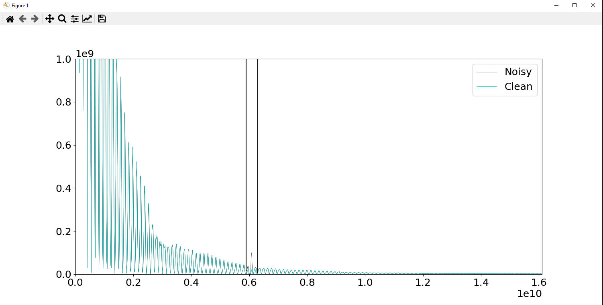
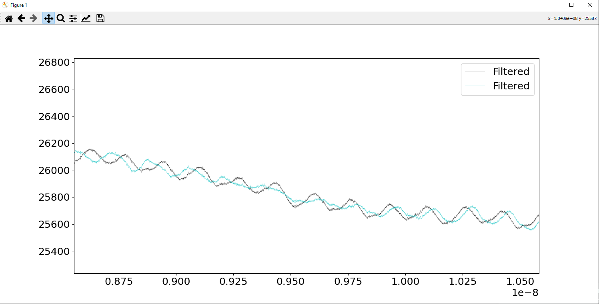

# FFT_FILTER-rough-
A rough draft of a python program to filter out periodic (repeating) noise in a signal. For this program, specifically a clock signal bleeding into the output signal.

*Attempted Normalization of Parasistic Signal*
Below is the FFT of the time domain data.  Enclosed in the 2 vertical black lines is the parasitic ~6ghz signal which the program detected.  I run a rudamentary algorithm to try and average out the frequency data.

*Time Domain Result of This Process*
Below is a closeup of a portion of the signal. The black line represents the signal before, and the blue line is after.  The Algorithm was a minor success, but it did not completely eliminate the parasitic(it appears that there are more harmonics of the 6ghz signal), and the algorithm may have been lightly destructive.  Further optimization required

